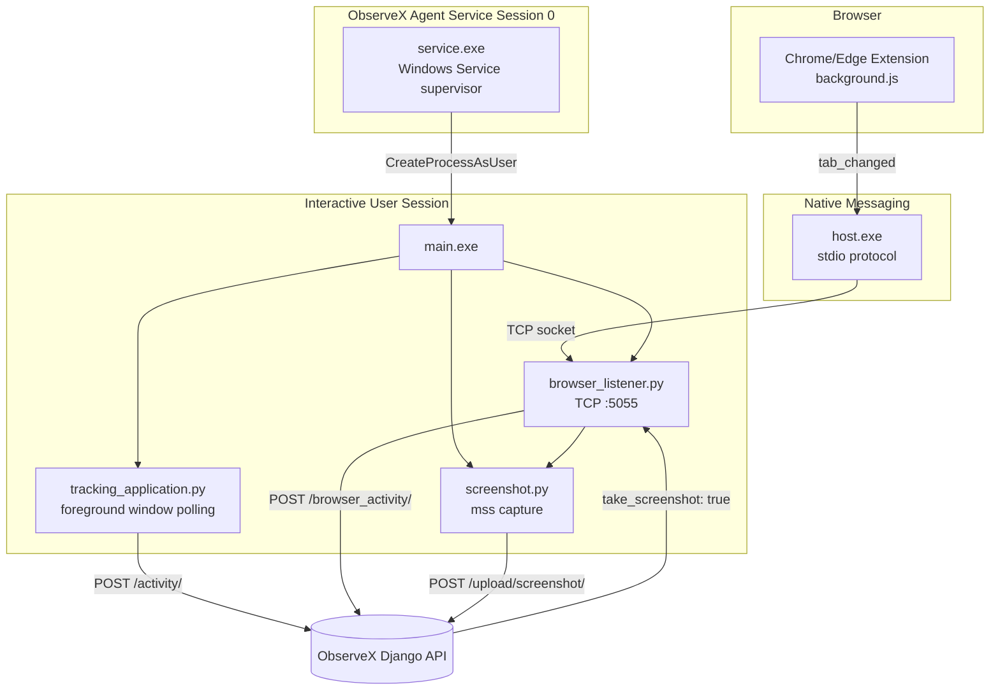
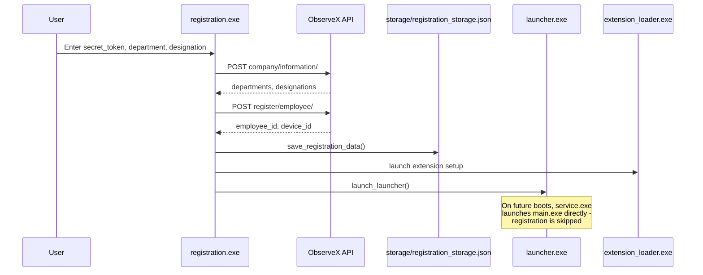

# 🖥️ ObserveX Agent

> **A native Windows endpoint agent — application/browser activity tracking, screenshot capture, and a Chrome/Edge extension bridge — reporting into the ObserveX platform in real time.**

ObserveX Agent is the client half of the ObserveX monitoring platform: a Windows service + companion browser extension that tracks active-window usage, follows browser navigation via native messaging, enforces blocked-website policy by triggering server-directed screenshot capture, and keeps every monitored device's status live on the [`observex`](../observex) dashboard.


<!-- 🎬 VIDEO DEMO -->
<!--
  Recommended: record a short walkthrough (60–90s) covering:
  installer run → registration screen → extension setup → visiting a
  blocked site → alert + screenshot appearing on the ObserveX dashboard.

  Once recorded, embed it here, e.g.:
  [](https://youtube.com/watch?v=YOUR_VIDEO_ID)
-->
### 🎥 [Watch the Demo Video](#) <!-- TODO: add demo video link -->

---

## Overview

ObserveX Agent runs on each monitored Windows machine and reports into the [`observex`](../observex) Django backend's ingestion API. It's built from several small, single-purpose Python components — a registration GUI, a background tracking process, a Windows Service supervisor, a native-messaging host, and a Chrome/Edge extension — each compiled to a standalone `.exe` with PyInstaller and wired together by an Inno Setup installer.

At a high level: the browser extension watches tab changes and forwards them through Chrome's native messaging API to a small local host process, which relays them over a loopback socket to the main tracking agent. The agent reports that activity to the server, and if the server determines the site is blocked (or the user has been idle too long), it tells the agent to capture and upload a screenshot — turning every policy-relevant moment into evidence without the agent needing to know the policy itself.

---

## Capabilities

### 🔗 Server Registration & Bootstrapping
- **GUI-driven registration** (`registration.py`, built as `registration.exe`) — collects a company `secret_token`, department/designation, and employee details, then registers both the employee and this device with the server in one step.
- **Local registration persistence** — registration state is written to `storage/registration_storage.json`, so subsequent launches skip straight to tracking instead of re-prompting.
- **Automatic device fingerprinting** — hostname, OS, CPU, RAM, MAC/IP address are collected and sent at registration and on every heartbeat.

### 🖱️ Activity & Idle Tracking
- **Foreground window tracking** (`agent_activity/tracking_application.py`) — polls the active process/window every second via `win32gui`/`win32process`/`psutil`, and reports a duration-stamped activity record every time the foreground app or window title changes.
- **Active/idle/break classification** — per-second input activity (`pynput`-based) is bucketed into active, idle, and break time, mirroring how the dashboard's analytics breaks down usage.
- **Periodic heartbeat** — a lightweight `device_id` ping every `HEARTBEAT_INTERVAL` seconds keeps the device's live "online" status current on the dashboard.

### 🌐 Browser Activity via Native Messaging
- **Chrome/Edge extension** (`extensions/chrome`, `extensions/edge`) — listens for tab activation and navigation-complete events and forwards `{ url, title, tabId, windowId }` to the native host.
- **Native messaging host** (`extensions/native_host/host.py`, built as `host.exe`) — the only process the browser is allowed to launch directly; it speaks Chrome's native-messaging stdio protocol and relays each event over a local TCP socket to the main agent.
- **Local socket bridge** (`agent_activity/browser_listener.py`) — the main agent listens on `127.0.0.1:5055`, forwards each browser event to the server's `browser_activity` endpoint, and reacts to the server's response.

### 📸 Server-Directed Screenshot Capture
- **Policy-blind capture** — the agent never evaluates blocked-website rules itself; it captures a screenshot only when the server's `browser_activity`/`activity` response says `take_screenshot: true` (a blocked-site match or an idle-threshold breach).
- **Full-monitor capture via `mss`** — screenshots are grabbed at the moment of the trigger, tagged with the current active window/process, uploaded, and deleted locally on confirmed upload.
- **Runs in the interactive user session** — the supervising Windows Service launches the tracking agent inside the logged-on user's own desktop session (not Session 0), which is what makes `GetForegroundWindow()` and screen capture actually work.

### 🧩 Packaging & Deployment
- **Six independently built executables** — `main.exe` (tracking agent), `service.exe` (Windows Service supervisor), `registration.exe`, `extension_loader.exe`, `launcher.exe`, and `host.exe` (native messaging host).
- **One-command build** — `build.bat` rebuilds every executable with `python -m PyInstaller`, using the exact hidden-imports each component needs (notably `win32ts`/`win32profile` for the service's session-aware process launch).
- **Inno Setup installer** (`installer/setup.iss`) — installs all binaries, registers the native-messaging host with Chrome and Edge via `HKLM` registry keys, installs and starts the Windows Service, and writes Start Menu/desktop shortcuts.

---

## Architecture



### Registration & First Run



### Design Principles

| Principle | Implementation |
|---|---|
| **Server owns policy, agent owns collection** | The agent never decides what's "blocked" or "idle too long" — it just reports events and reacts to a `take_screenshot` flag the server computes |
| **Session-aware process supervision** | The Windows Service never runs the tracking/capture logic itself in Session 0; it launches `main.exe` inside the real interactive user session via `CreateProcessAsUser` |
| **Narrow native-messaging surface** | `host.exe` does nothing but relay bytes between Chrome's stdio protocol and a local socket — no business logic lives in the one process the browser can launch |
| **Resilient by design** | The service supervises and restarts the agent process; the browser listener wraps server calls so a single failed request doesn't kill activity tracking |
| **Build reproducibility** | `build.bat` rebuilds every executable from source with pinned PyInstaller invocations, so binaries always match the checked-in code |

---

## Technology Stack

<table>
<tr>
<td valign="top" width="33%">

**Core Agent**
- Python 3.14
- `requests` (HTTP client)
- `psutil` (process inspection)
- `pynput` (input activity)
- `mss` + `Pillow` (screenshot capture)

</td>
<td valign="top" width="33%">

**Windows Integration**
- `pywin32` (`win32gui`, `win32process`, `win32ts`, `win32profile`, `win32service`, `win32serviceutil`, `servicemanager`)
- `uiautomation` (optional live tab-URL detection)
- `customtkinter` (registration / extension-setup GUIs)

</td>
<td valign="top" width="33%">

**Browser Bridge**
- Chrome/Edge Manifest V3 extension
- Chrome Native Messaging (stdio protocol)
- PyInstaller (all six executables)
- Inno Setup (Windows installer)

</td>
</tr>
</table>

---

## Project Structure

```text
observex_agent/
├── main.py                        # Entry point - starts tracking + browser listener threads
├── service.py                     # Windows Service supervisor (session-aware launch)
├── registration.py                # GUI: company token + employee/device registration
├── launcher.py                    # Shortcut target - launches the agent if not registered
├── extension_loader.py            # GUI: guides the user through installing the browser extension
├── config.py                      # SERVER_URL, API endpoint paths, intervals
├── build.bat                      # Rebuilds every .exe with python -m PyInstaller
├── requirements.txt
│
├── agent_activity/
│   ├── tracking_application.py      # Foreground app/window polling + duration tracking
│   ├── application_detection.py      # win32gui/win32process/psutil active-window lookup
│   ├── browser_listener.py            # TCP :5055 server - receives events from host.exe
│   ├── browser_detection.py            # Detect which browser is currently foregrounded
│   ├── browser_url.py                   # Optional history/UI-Automation URL fallback
│   ├── screenshot.py                     # mss capture + upload, triggered by server response
│   ├── mouse.py / keyboard.py             # Input listeners feeding idle/active detection
│   └── activity.py                         # Active/idle status computation
│
├── client/
│   ├── client.py                    # post()/upload() - shared requests wrappers
│   ├── heartbeat.py                  # send_heartbeat()
│   ├── activity.py                    # send_activity()
│   ├── screenshot.py                   # upload_screenshot()
│   ├── register_employ.py               # register_employee()
│   └── company_info.py                   # get_company_info()
│
├── device/
│   └── device_info.py               # Hostname, OS, CPU, RAM, MAC/IP collection
│
├── storage/
│   └── register.py                  # Local registration persistence (registration_storage.json)
│
├── utils/
│   └── logger.py
│
├── extensions/
│   ├── chrome/                      # Manifest V3 extension (background.js, manifest.json)
│   ├── edge/                        # Edge build of the same extension
│   ├── native_host/
│   │   ├── host.py                    # stdio <-> TCP relay, built as host.exe
│   │   ├── native_host.json             # Chrome native-messaging manifest
│   │   └── native_host_edge.json         # Edge native-messaging manifest
│   └── generate_key.py               # Generates the extension's signing key
│
└── installer/
    ├── setup.iss                    # Inno Setup script - files, registry, service install
    └── extension_loader.spec
```

---

## Installation

### Requirements
- Windows 10/11
- Python 3.14
- Administrator privileges (for service install and registry writes)

### Build from source

```bash
git clone YOUR_REPOSITORY_URL
cd observex_agent
python -m venv venv
venv\Scripts\activate
build.bat
```

`build.bat` installs `requirements.txt` + PyInstaller, then builds `main.exe`, `service.exe`, `registration.exe`, `extension_loader.exe`, `launcher.exe`, and `host.exe` in place, matching the layout `installer\setup.iss` expects.

### Package the installer

```bash
:: with Inno Setup Compiler (ISCC.exe) on PATH
ISCC.exe installer\setup.iss
```

This produces `installer\ObserveX_Setup.exe`, which installs all binaries, registers the native-messaging host with Chrome/Edge, and installs + starts the `ObserveXAgent` Windows Service.

### Point the agent at your server

```python
# config.py
SERVER_URL = "http://127.0.0.1:8000"   # your ObserveX backend URL
```

---

## Usage

1. **Install** — run `ObserveX_Setup.exe` (or the individual built `.exe`s) on the target machine as Administrator.
2. **Register** — `registration.exe` launches automatically on first run; enter the company's `secret_token` (from the ObserveX dashboard) plus department/designation/employee details.
3. **Install the browser extension** — `extension_loader.exe` opens the extensions folder and Chrome's/Edge's extension page so the unpacked extension can be loaded.
4. **Agent runs unattended** — the `ObserveXAgent` service keeps `main.exe` running inside the user's session, tracking activity and reporting heartbeats automatically from then on.
5. **Policy enforcement happens server-side** — visiting a blocked site or going idle triggers a `take_screenshot` response from the server, which the agent acts on immediately.

---

## Engineering Highlights

- **Session 0 isolation solved correctly** — rather than the common mistake of running screen-capture logic directly inside a SYSTEM service, `service.py` uses `WTSQueryUserToken` + `CreateProcessAsUser` to launch the tracking agent inside the real interactive desktop session.
- **Clean process boundary at the native-messaging edge** — `host.exe` is a minimal, dumb relay; all real logic lives in the main agent, keeping the one process Chrome can spawn directly as small and auditable as possible.
- **Decoupled policy enforcement** — the agent has zero knowledge of what "blocked" means; it's a pure event reporter reacting to a server-computed flag, so policy changes never require redeploying the agent.
- **Reproducible, single-command builds** — `build.bat` pins every PyInstaller invocation (including hidden-imports that PyInstaller can't auto-detect for `pywin32` service modules), so a fresh checkout always produces working binaries.
- **Graceful degradation** — heartbeat, activity, and browser-listener calls are wrapped so a transient network failure doesn't take down tracking threads permanently.

---

## Skills Demonstrated

**Windows Systems Programming** — Win32 API usage (`win32gui`, `win32process`, `win32ts`, `win32profile`), Windows Service development with `win32serviceutil`, Session 0 isolation and `CreateProcessAsUser` token impersonation.

**Browser Extension Development** — Manifest V3 extension architecture, Chrome Native Messaging protocol (length-prefixed stdio framing), cross-browser (Chrome/Edge) packaging.

**Systems Integration** — bridging three separate runtimes (browser extension JS, native-messaging host process, main tracking agent) over stdio and TCP sockets into a single coherent event pipeline.

**Desktop Application Packaging** — PyInstaller onefile/onedir builds with explicit hidden-import management, Inno Setup installer scripting, Windows registry configuration for native messaging hosts.

**Client-Side Networking** — resilient HTTP client wrappers, multipart file upload for screenshots, heartbeat/health-check patterns.

---

## Use Cases

- **Endpoint client for the ObserveX platform** — deployed on company-owned Windows machines under an organization's monitoring policy.
- **Reference implementation** of correctly handling Windows Session 0 isolation for any agent that needs both SYSTEM-level supervision and interactive-desktop access.
- **Portfolio demonstration** of native Windows systems programming combined with browser-extension integration and full packaging/installer tooling.

---

## Roadmap

```markdown
- [x] Foreground application/window tracking with active/idle/break classification
- [x] Chrome/Edge extension + native messaging bridge
- [x] Server-directed screenshot capture on blocked-site/idle triggers
- [x] Windows Service supervisor with session-aware process launch
- [x] Single-command PyInstaller build pipeline
- [x] Inno Setup installer with native-messaging registry configuration
- [ ] Automatic agent self-update
- [ ] Firefox extension support
- [ ] Encrypted local registration storage
- [ ] Structured logging with rotation
```

## Future Enhancements

- **Self-update channel** — have `service.py` check for and apply new `main.exe` builds without a full reinstaller run.
- **Additional browser support** — the native-messaging host and event schema are already browser-agnostic; a Firefox build could reuse the same `browser_listener.py` pipeline.
- **Structured, rotated logging** — replace the current flat log files with a rotating handler and structured (JSON) log lines for easier ingestion.
- **Config hardening** — move `SERVER_URL` and other config out of a plain `config.py` and into a signed/encrypted local config file.

---

## Related Project

**[`observex`](../observex)** — the Django backend and dashboard this agent reports into.

---

## Author

**Sameer Raza**

Building native Windows systems software with a focus on correct process/session handling and clean integration boundaries between browser, OS, and server.

- GitHub: `YOUR_GITHUB_URL`
- LinkedIn: `YOUR_LINKEDIN_URL`
- Portfolio: `YOUR_PORTFOLIO_URL`